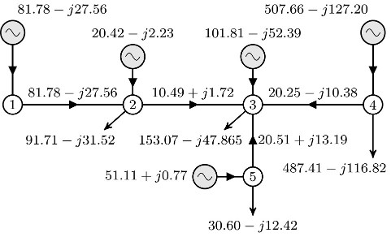
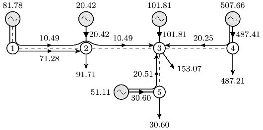

# Loss Allocation in Distribution Networks with DG

With the promotion of renewable energy sources and their increased use 
as distributed generators (DG) in power distribution networks and with the liberalization of the electricity market the importance of
distribution loss allocation has increased. In this line, we propose a method for loss allocation in distribution networks with DG. The method treats DG as power sources that are supplying load and traces currents from all sources to all loads. The losses are expressed as a product of branch voltage and current components, yielding linear function in 
currents. Therefore, there are no quadratic expressions and problems with 
non-separability of losses. The method is exact and features uniquely 
attributable losses to each generator-load pair. It breaks down the losses in such a way that one may investigate how each power transaction contributes to the losses.

A simple distribution network is shown in following Fig. 1 where bus 1 is the slack (supply) bus and there are loads and distributed generator in buses 2-5. The complex powers of loads and generators are given in Tab. 1 in columns $S^d$ and $S^g$, respectively. All branches are the same with impedance $Z = (2.05+j1.8)\,\Omega$, while the voltage of the supply bus is $V_1 = 10\,{\rm kV}$. All data are given in function `case5` which returns a structure `ds`.

The network can be solved with the following command

`ds = dist_pf('case5')`

After solving the network we obtained the currents shown in Fig. 1. Bus voltage magnitudes and angles are given in Tab. 1 in columns $|V|$ and $\theta$, respectively. The complex power of the slack bus generator is $S_1^g = (817.779+j275.611)\,{\rm kVA}$, so that the total network losses are $\Delta S = (17.779+j15.611)\,{\rm kVA}$.

Tab. 1. Load and Generator Data

| Tab. 1. | Bus |  $S^d$ (kVA)    |  $S^g$ (kVA)   | \|$V$\| (kV) | $\theta$ (deg) |
|:-------:|:---:|:---------------:|:--------------:|:------------:|:--------------:|
|         |  2  |  900 $+j$  300  |  200 $+j$   20 |    9.7832    |   $-$ 0.531    |
|         |  3  | 1500 $+j$  450  | 1000 $+j$  500 |    9.7650    |   $-$ 0.664    |
|         |  4  | 4800 $+j$ 1100  | 5000 $+j$ 1200 |    9.8250    |   $-$ 0.571    |
|         |  5  |  300 $+j$  120  |  500 $-j$   10 |    9.7828    |   $-$ 0.288    |

||
|:---:|
|Fig. 1. Simple Illustrative Example -- Complex Currents Flows (Amperes)|

Loss allocation is performed with the following command

`[ds, LA, gen_bus] = loss_allocation('case5')`

which generates the output file `loss_allocation.txt` where are results are written. They include:
- power flow solution,
- load current components supplied by each generator,
- loss allocation for active and reactive power separately.

 In Fig. 2 we show real parts of load current components for each generator and branch, so one may trace the routes of currents from generators to each load in the network. Similar figure can be drawn for reactive current components as well.

||
|:---:|
|Fig. 2. Real Parts of Load Current Components (Amperes)|

Loss allocation for active and reactive power are given in Tab. 2 and 3, respectively.

Tab. 2. Loss Allocation for Active Power Losses (kW)

|        |   Gen 1   | Gen 2 |  Gen 3 |  Gen 4 |  Gen  5 | Total  |
|------- |:---------:|------:|-------:|-------:|--------:|-------:|
| Load 2 |   12.987  |       | 0.012  | 0.009  |         | 13.007 |
| Load 3 |    2.473  |       |        | 1.219  | 0.376   |  4.068 |
| Load 4 |           |       |        |        |         |      0 |
| Load 5 |           |       | 0.256  | 0.448  |         |  0.704 |
| Total  |   15.460  | 0     | 0.268  | 1.676  | 0.376   | 17.779 |

Tab. 3. Loss Allocation for Reactive Power Losses (kvar)

|        |   Gen 1   | Gen 2 |  Gen 3 |  Gen 4 |  Gen  5 | Total  |
|------- |:---------:|------:|-------:|-------:|--------:|-------:|
| Load 2 |   12.453  |       | -0.010 | 0.050  |         | 12.494 |
| Load 3 |   1.187   |       |        | 0.307  | 1.312   |  2.806 |
| Load 4 |           |       |        |        |         |      0 |
| Load 5 |           |       | -0.073 | 0.385  |         |  0.311 |
| Total  |   13.640  | 0     | -0.083 | 0.742  | 1.312   | 15.611 |

There is no loss allocated to load at bus 4 since it is locally supplied by the generator at the same bus. Similarly, there is no loss allocated to generator at bus 2 since its all current is locally consumed by the load at bus 2.

In case we would like to allocate a single loss portion to each load an 
generator we must adopt a rule for loss sharing between loads and generator. In function `la_split` we consider a case where generators and loads are both responsible for half of the total losses. By executing

`[LAd, LAg] = la_split(LA)`

we obtain the following results.

Tab 4. Loss Allocated to Loads (kW)

| Bus    |     2 |     3 |     5 |
|:------:|:-----:|:-----:|:-----:|
| Loss   | 6.504 | 2.034 | 0.352 |

Tab 5. Loss Allocated to Generators (kW)

| Bus    |     1 |     3 |     4 |     5 |
|:------:|:-----:|:-----:|:-----:|:-----:|
| Loss   | 7.730 | 0.134 | 0.838 | 0.188 |